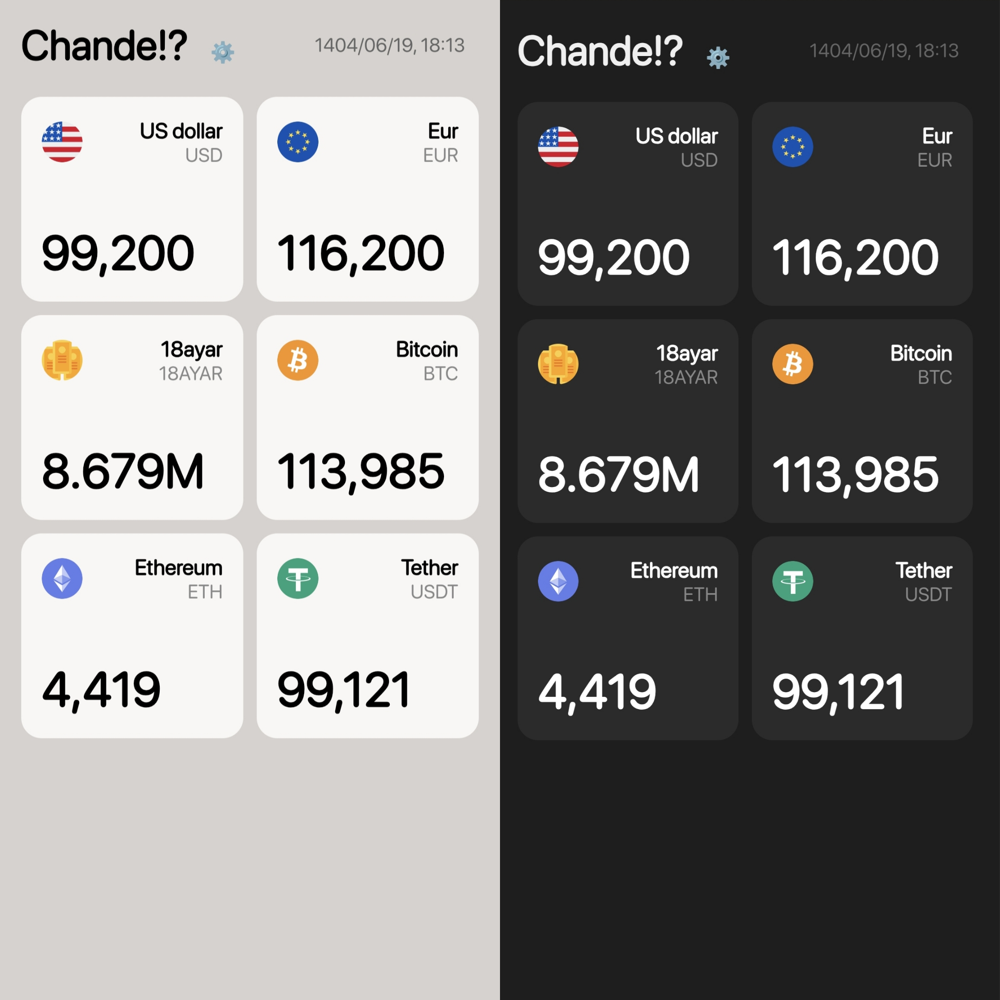

# Chande?!

Chande?! is a fast, minimal, and installable web app for tracking real-time currency and cryptocurrency prices.

## Features

✅ Real-time currency and cryptocurrency prices  
✅ Price change tracking  
✅ Clean and minimal user interface

## How to Install

1. Simply visit the following URL:

🔗 https://certmusashi.github.io/Chande/

2. Once the page loads, select **Add to Home Screen** or **Install** to install the app on your device.

---

## Data Source

Currency prices are fetched from the following API:  
🔗 **[Chande API](https://github.com/CertMusashi/Chande-api)** –

## Contributing

If you have any ideas for improvements or bug fixes, feel free to submit a Pull Request or open an Issue.

---

❗**This app is inspired by the [Chand!?](https://apps.apple.com/us/app/chand/id1524200188) iOS app and has no affiliation with it.**

---

