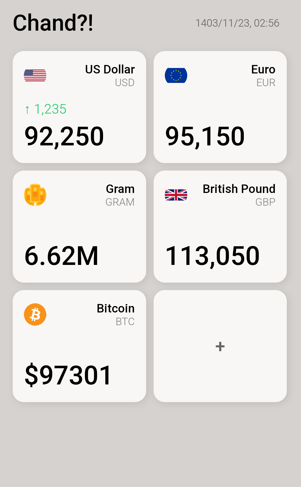

# **Chand?! (Clone)**

این یک پروژه‌ی **اوپن سورس و کلون شده** از اپلیکیشن [Chand?!](https://apps.apple.com/us/app/chand/id1524200188) هست که فقط برای iOS منتشر شده بود. در این نسخه، ظاهر و آیکون‌ها مشابه نسخه‌ی اصلی طراحی (کپی) شده‌اند، اما این پروژه هیچ وابستگی‌ای به توسعه‌دهنده‌ی اصلی ندارد.

## **ویژگی‌ها**
✅ نمایش قیمت لحظه‌ای ارزهای رایج و رمزارزها 

✅ نمایش تغییرات قیمت (نسبت به آخرین قیمت دیده شده) 

✅ رابط کاربری (تقریبا) مشابه نسخه‌ی اصلی Chand?! 

✅ قابلیت افزودن یا حذف ارزهای دلخواه از لیست  

### **نصب **
1. کافی‌ست به آدرس زیر برید:

🔗 [https://certmusashi.github.io/Chand/](https://certmusashi.github.io/Chand/)

2. بعد از باز کردن صفحه، گزینه‌ی **Add to Home Screen** یا **Install** رو انتخاب کنید.

## **منابع**  
قیمت ارزها از پروژه‌ی زیر دریافت می‌شود:  
🔗 **[Chand API](https://github.com/CertMusashi/Chand-api)** –

## **مشارکت در پروژه**
اگر ایده‌ای برای بهبود عملکرد یا رفع باگ دارید، می‌توانید **Pull Request** بفرستید یا در **Issues** مطرح کنید.

---
.
---

